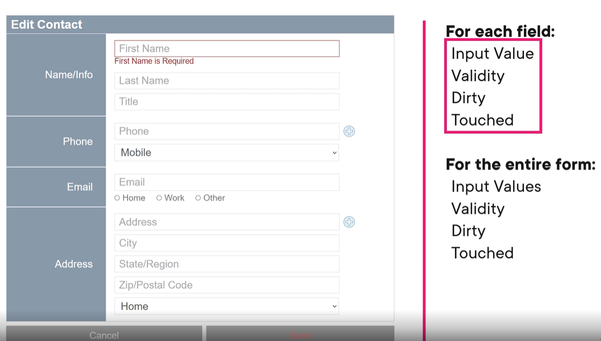
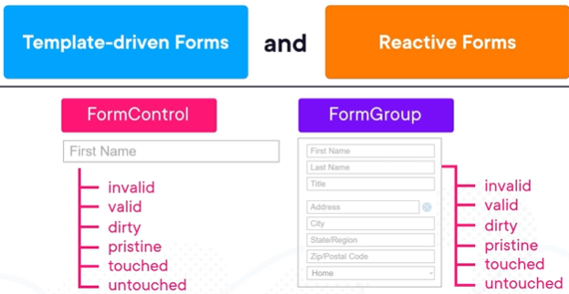
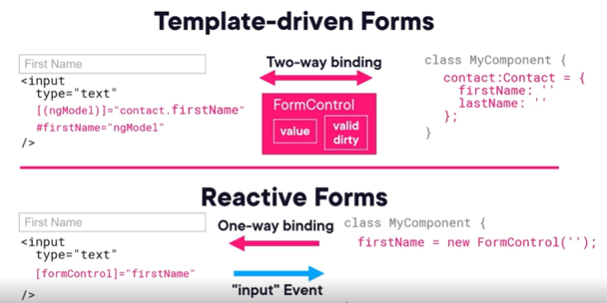
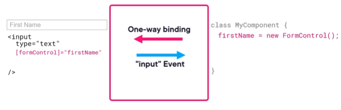
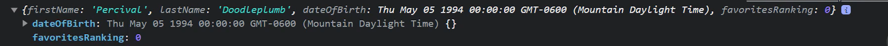
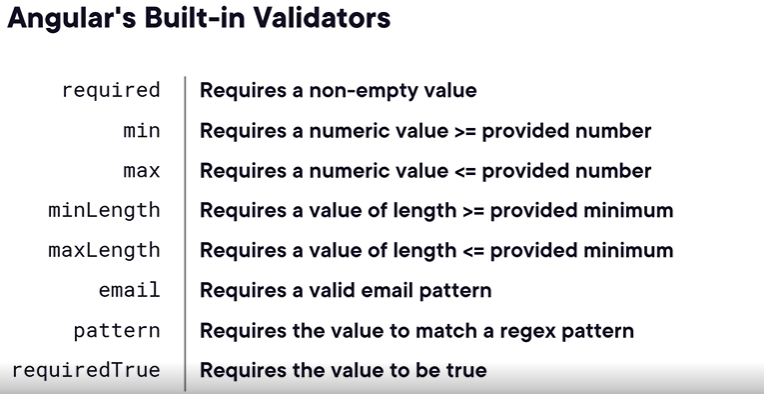

# Reactive forms

Reactive forms are better suited for more complex forms than template driven forms. They are better as well if our preference is to have more code driven forms, instead of html driven forms.
We are going to use the same template as we did for the course of template driven forms: edit user contacts.
On a form, we usually want to track lots of flags per field:


It is a lot of flags and fields. We also need to take into account the validity of groups or the form as a whole.
Angular uses form controls and forms groups to track all of this information. Form controls track that for individual fields, form groups to groups of input fields.
Form controls and form groups constitute the form model. This is the bulk of form architecture, if we use either template or reactive forms.

## Template driven vs reactive forms

Both forms use the same type of underlying architecture:


In template driven forms, these objects are created for us. In reactive forms, we are the ones creating them and working with them in our component's classes.

So what is the difference in practice?



1. Template driven forms are mostly managed inside the HTML template where as reactive forms are largely defined inside components typescript class. We can create local template variable using # and access its attribute for validation right inside the template.
2. Template driven forms use a separate data model we define where as in reactive forms the data model is managed internally by form controls
3. Template driven forms use two way bindings (mutable) and reactive form use one way binding from the component to the template. User input changes are handled with events.
4. Given the event nature, template driven froms use synch data flow and reactive forms async data flow.
5. In template, validation is handled with directives where as in reactive with functions.

Reactive forms may be better form complex forms with lots of backend logic, whereas template driven forms are more lightweight and quicker to implement.

Before diving in, we are using an Angular in memory web api. So we simulate actually http calls to the server but in memory.
When we click in a contact we navigate to the edit form. Check the Url we pass the id as the argument.

## Adding reactive forms to a project

The first step is to add the reactive forms module to an angular project.
We just need to import it in the module we want to use it or, if we use standalone components, in the component directly. In this course we just imported it in the app module:

```
import { ReactiveFormsModule } from '@angular/forms';
...
  imports: [
    BrowserModule,
    AppRoutingModule,
    HttpClientModule,
    ReactiveFormsModule,
    HttpClientInMemoryWebApiModule.forRoot(InMemoryContactsApi, { delay: 200 })
  ],

```

Of course, we should only import in the modules we actually need it.
Having plain html on our template file, we we will start by creating form controls for some input elements we already have. Starting with first name:

```
firstName = new FormControl();
```

This form control will be used to collect the first name value and perform validation, etc..
We wire up with the input element using a form control binding:

```
        <input [formControl] = "firstName" placeholder="First Name" />

```

The formControl binding will make angular track field value, if it is dirty or touched, valid , etc
This creates a one way binding between the component and the input element.
Then it uses the input event to update the formscontrol value when the input value changes. How does angular do that?
What is the piece in the middle that makes that happen?

The magic is done by a directive called ControlValueAccessor. When we use formControl binding Angular attaches a control value accessor directive to the input element.
A control value accessor has 2 key methods: writeValue (when the value on our component class changes, angular updates the input element) and onChange (when the input element changes value, we update the component class).
We can inialize form controls with default values like this:

```
firstName = new FormControl('Jimoo');
```

When we want to fetch data from an api we can use the forms control set value method like this:

```
 ngOnInit() {
    const contactId = this.route.snapshot.params['id'];
    if (!contactId) return

    this.contactsService.getContact(contactId).subscribe(
      (contact) => {
        if(!contact) return;
        this.firstName.setValue(contact.firstName)
      }
    )
  }
```

## Form groups

Form groups make form validation easier. It also make feeding the form with data easy too. Form groups can group form controls and can be created like this:

```
  contactForm = new FormGroup({
    firstName: new FormControl,
    lastName: new FormControl,
    dateOfBirth: new FormControl,
    favoritesRank: new FormControl,

  });
```

Now the way we access the form controls changes to this:

```
        this.contactForm.controls.firstName.setValue(contact.firstName)
```

The binding in the template changes as well. We can bind the form to our form group. When we do that each input element inside the form only needs the form control name attributte. The form control name attribute needs to match the name of the property of the form control object inside the group:

```
 <form [formGroup]="contactForm">
    <section>
      <nav>Name/Info</nav>
      <div>
        <input formControlName = "firstName" placeholder="First Name" />
```

## Submitting the form

The way we are saving so far is not correct. The proper html standard is to submit the form. Submitting the form correctly is also more accessbile to the user by allowing it to use the enter key.
For submitting the form, we use the ngSumit direct at the form level:

```
  <form [formGroup]="contactForm" ngSubmit="saveContact()">

```

The save button needs to be changed to type submit. We also do not need to bind to the save method anymore:

```
      <button class="primary" type="submit">Save</button>

```

Having a form group we can easly access all form controls with value property:

```
  saveContact() {
    console.log(this.contactForm.value);

  }
```

The value property of the form group is an javascript object with properties equivalent to the form controls defined on it:


Form groups do not include properties that are disabled in the HTML interface, so typescript knows that a form group might not have certain properties and gives us an error if we use the form group value directly in our save contact servicr method. One way to solve this is to mark all fields as optional in the contact interface.
If we would have all the properties as form controls in our form group we could use form.getRawValue().
A third wat to solve, which is the better one for our use case is to chage the contact service to accept a partial contract:

```
saveContact(contact: Partial<Contact>)
```

This is the best for this use case because we not expect users to fill every single property like contact id, or non mandatory fields etc.
The id is important though because contact service checks if the contact has an id to verify if it should update an existing contact or create a new one. We can save the id in the component or add it to the form group. We can add it to the form group without adding it to the html template (which we shouldn't).

### Nested Form groups

So far we have isolated form controls. What about nested forms? Our object Phone is for example, an object itself. The same for address.
We can just create nested form groups with form controls. Later this can also help us with field group validation:
Our form group now looks like this:

```
    address: new FormGroup({
      streetAddress: new FormControl,
      city: new FormControl,
      state: new FormControl,
      postalCode: new FormControl,
      addressType: new FormControl,
    })
```

In order to save we can use getRawValue because phone and addresses can be partial objects and angular might infer they might not exist.

```
    this.contactsService.saveContact(this.contactForm.getRawValue()).subscribe({
      next: () => this.router.navigate(['/contacts'])
    })
```

Last step is to wire up in the html template with a directive formGroupName for the phone container and formControlName for each phone fields:

```
     <div formGroupName="phone" class="flex-column">
        <div class="flex-group">
          <input formControlName = "phoneNumber" placeholder="Phone" />
          
        </div>
```

Of ocurse, and populate this elements during loading, following the hierarchy of form groups:

```
        this.contactForm.controls.phone.controls.phoneNumber.setValue(contact.phone.phoneNumber);
```

If we do this with all the properties things start to get a little messy. It can be improved with a FormBuilder. If the form builder object matchs the contact interface type we can remove all the initialization boilerplate and initialize the form like this

```
this.contactForm.setValue(contact);
```

We initialize the contact form like this:

```
  contactForm = this.fb.nonNullable.group({
    id: '',
    firstName: '',
    lastName: '',
    dateOfBirth: <Date | null> null,
    favoritesRanking: <number | null> null,
    phone: this.fb.nonNullable.group({
      phoneNumber: '',
      phoneType: '',
    }),
    address: this.fb.nonNullable.group({
      streetAddress: '',
      city: '',
      state: '',
      postalCode: '',
      addressType: '',
    })
  });
```

The fb is of type FormBuilder.
We can use this.contactForm.PatchValue to initialize just some of the fields and not the entire form

## Common input elements and data types

### Radio buttons

Setting formControlName in a group of radio buttons makes it possible use reactive forms with them. It also makes that exclusive to each other, if a set of radio buttons has the same formControlName property, otherwise they will be independent.
This is the same as setting the name attribute to the same value with a traditional HTML form.

### Select lists

Simpler than radio buttons. We set the formControlName and then generate a lits of options.

```
      <select formControlName="addressType">
            <option *ngFor="let addressType of addressTypeValues" [value]="addressType.value">{{addressType.title}}</option>
          </select>
```

### checkboxes

Lets add a check box to check if a contact is a personal contact.
After adding a property to our model and to the form control we can add it to the template:

```
        <div>
          <input type="checkbox" formControlName ="isPersonal"/>
        </div>
```

We do not need to specify a value because reactive forms treat checkboxes as boolean
When we apply the formControlName attribute to an input element of type checkbox, angular applies a special control value accessor into it: checkboxcontrovalueaccessor.
even if we set the value of the input element to a string like 'foo' the this cva always ensures we have the type of boolean and not string (becasue the property is completely ignored).

### Numeric input elements

Our favourites ranking field is actually working as type string behind the scenes. It is a plain old input text element, and when we apply the formControlName directive, it is assigned the default cva, that it updates the elements as string.
Angular has a numericValueAccessor, that can be used.So we need to change te type to number:

```
        <input formControlName = "favoritesRanking" type="number" placeholder="Favorites Ranking" />
```

This prevents the insertion of letters, etc

### Range inputs

We can also use range as a type (it will render as a slider control).
Angular has a range value accessor that supplies numeric values.

```
        <div>
          <span>Favourites Ranking:</span>
          <input formControlName = "favoritesRanking" type="range" min="0" max="5" placeholder="Favorites Ranking" />
          <span>{{contactForm.controls.favoritesRanking.value}}</span>

        </div>
```

### Text area

Similar to other text input type elements.

```
    <section>
      <nav>Notes</nav>
      <textarea placeholder="Notes" rows="5" formControlName="notes"></textarea>
    </section>
```

### Date fields

The date field in the beginning looks a little ugly because it uses the default value accessor. We can try to improve it by using the date field like this:

```
    <input formControlName = "dateOfBirth" type="date" [value]="contactForm.controls.dateOfBirth.value | date:'yyyy-MM-dd'"
        placeholder="Date of Birth" />
```

Even when we use it like this, Angular still treats this value as a string. Angular does not have an out of the box value accessor for dates.
the options we have are either create a custom valie accessor or just work with dates as string, which is fine most of the time.
We can leave that pipe like that on the template (the type date gives us the date picker out of the box). Now, on our service we can just change the type to string and format the value accordingly:

```
// contact service
    .pipe(map(c=> {c.dateOfBirth = c.dateOfBirth.split('T')[0];
      return c
    }));
```

## Validation in reactive forms

We add validation to reactive forms by adding validators to form controls.
Out of the box validators in Angular:

In template driven forms, we would add the required attribute to an input control element directly on the template.
In reactive forms, we create the form controls ourselves and we will add the validators in the component class directly. We can pass an array of validators to the form control constructor.
We are using form builder and we can do that in a similar way. See the required validator for the field first name:

```
  contactForm = this.fb.nonNullable.group({
    id: '',
    isPersonal: false,
    firstName: ['', Validators.required],}) // required field validator
```

To show an error message when the first name is empty we can use the invalid property:

```
       <em *ngIf="contactForm.controls.firstName.invalid && contactForm.controls.firstName.touched ">Please enter a First Name</em>
       // show when emppty and when field is touched so when creating a new contact we do not have an error immediatly.
```

We can simplify the syntqx by adding properties in the component class:

```
  get firstName()
 {
   return this.contactForm.controls.firstName;

 }
```

Then the code in the template gets simplified:

```
<em *ngIf="firstName.invalid && firstName.touched ">Please enter a First Name</em>
```

Using the property invalid is not the most flexible approach when we need to show a message specific to a validator and we have more than one validator, because the all the validators that are failing will turn the invalid property to true and we might show misleading error messages. To overcome that we use the error property, like we show in the following example where we added a second rule (name needs to have a min lenght of 3):

```
<em *ngIf="firstName.errors?.['required'] && firstName.touched ">Please enter a First Name</em>
       <em *ngIf="firstName.errors?.['minlength'] && firstName.touched ">First Name must be at least 3 characters.</em>
```

### Validate form groups

Like individual fields, we can validate form groups and entire forms. Let's add validation to the form group address. First we start by adding individual validators to the fields we want to validate.If any of the elements of the form group are invalid or dirty, the form group will be invalid or dirty.
See an example of how to validate the address form group:

```
        <div formGroupName="address" class="address" [class.error]="contactForm.controls.address.invalid && contactForm.controls.address.dirty">
         <div class="flex-group">
           <input placeholder="Address" formControlName ="streetAddress" />
           
         </div>
         <input placeholder="City" formControlName ="city" />
         <input placeholder="State/Region" formControlName ="state" />
         <input placeholder="Zip/Postal Code" formControlName ="postalCode" />
         <select formControlName="addressType">
           <option *ngFor="let addressType of addressTypeValues" [value]="addressType.value">{{addressType.title}}</option>
         </select>
       </div>
       <em *ngIf="contactForm.controls.address.invalid && contactForm.controls.address.dirty">Incomplete Address</em>
     </div>
```

Because the whole form is also a form group, we can take advantage of this type of validation to check if the entire form is valid. We can use that to prevent the submission of the form with invalid data:

```
      <button class="primary" type="submit" [disabled]="contactForm.invalid" >Save</button>
```

### Creating custom validator

Creating custom validator are implemented by exporting functions. If we need to pass data into our custom validator we need to wrapp that function in another functions. Lets see an example of restricting some words that cannot be enterred in the notes field. For that, lets create the restricted-words-validator:

```
import { AbstractControl, ValidationErrors } from "@angular/forms";

export function restrictedWords(words: string[]){

    return (control : AbstractControl) : ValidationErrors | null =>
        {
            const invalidWords = words.map(w => control.value.includes(w)? w : null).filter(w => w!== null)
            return invalidWords.length > 0 ? {restrictedWords : invalidWords.join(',')} // I can set the return to any object
            : null
        }

```

Because the validator accepts a list of invalid words we can set the parameters to the function like this (component class):

```
    notes: ['', restrictedWords(['foo', 'bar'])],
```

Also because the validator is returning a list of invalid words we can see it in the UI:

```
      <em *ngIf="notes.errors?.['restrictedWords']">Restricted words found: {{notes.errors?.['restrictedWords']}}</em>

```
