# So, What is This?

This repository contains all code examples for the demos from my [Pluralsight](https://www.Pluralsight.com "Pluralsight") course: Styling Angular Applications. Use these files to follow along with the course or for whatever you want really.

# Styling Angular Applications

Angular revolutionizes the way that we architect CSS for modern web applications. But before we can become Angular styling ninjas we need to take a step back consider the many different ways that things can be done. In this course we explore how the framework aligns with web components and what that means for adding styles to components and apps in general. Throughout this course we develop systems geared towards organization, scale, and maintainability for HTML and CSS within Angular apps. And as we get more comfortable adding and styling components within these systems we consider component themes and the ways that we can transform their look under certain circumstances. By the end of this course we'll have a strong knowledge of how Angular processes CSS and the many different ways it can be leveraged as part of an overall design system for creating beautiful, organized, maintainable, and future proof web applications.

##### Introduction

There are many considerations when it comes to CSS and styling applications in Angular and in this module we explore, at a high level, many of the concepts we will cover in this course.

##### How Styles Work in Angular

In this module we dive into how styles work in Angular. We cover how the different view encapsulation modes work, what they mean as far as the rendered code and style scoping, and why you may want to use each of them. We explore some of the different ways that we can add styles to components, how Angular handles them, and how their priority flows through. And lastly, we dig into how Angular emulates Shadow DOM, CSS Scoping Module selectors, what they look like when rendered in the browser, and how/why we would want to use them.

##### Scalable, Maintainable CSS/SCSS Architecture in Angular

In this module we leverage the default Emulated view encapsulation mode for angular components along with the SASS preprocessor to cover concepts regarding global styles, variables, and mixins. We explore aspects regarding CSS selectors and class naming conventions both at a global app level as well as at a local component level. We develop a system for applying CSS relative units across components with reliability. And we utilize SASS variables and mixins to create relationships between styles within individual components and across multiple components making them easier to edit and maintain over time.

##### Creating Component Themes

In this module we focus on what a component theme is and on creating components that will vary their look under certain criteria. First we will look at explicitly setting component themes per instance by adding classes and properties to our components and exploring what this SCSS/CSS looks like. We then look at providing context aware themes to our components that automatically change styles based on the surroundings of the component using the :host-context selector. We use methods to determine if theme classes have been provided or if projected content exists to conditionally alter the look of components. And finally we explore the future of component theming with CSS Custom Properties.

##### It's Wrap

In this module we recap, at a high level, the core concepts and takeaways from the course and get ourselves set up to build amazing Angular applications that look great today and are easy to bring forward into the web of tomorrow.

## How to Use It

In order to work with this project here's what you'll need to do...

### Install and Set Up

1. Build the code, watch for file changes, and serve up the site locally<br />`npm start`.
2. Ng serve wont work because ssl error of old versions of nodejs.

## Styling Angular Applications

Most of the web these days is developed using web components. Angular provided much more than web components provide out of the box.
When using Angular we are pratically building web components.
Web components are bundles of modular HTML, CSS and Javascript that represent portions of the UI in the browser. They provide a way to isolate and reuse sections of an application. These web components can be reused within the same application or across several applications.
Web components are composed of:

1. Custom elements: they allow us to use and create our own custom elements. So we create a component and just use it in HTML, by declaring the custom element where we need it.
2. HTML templates: fragments of markup that are not actually rendered to the page. Their purpose is to be reference and cloned into a specific location. The structure of the markup that it will be bundled into our component.
3. Shadow DOM: essential. It is the encapsulated DOM that we have access within our component to styling and scripting against. A set of JavaScript APIs for attaching an encapsulated "shadow" DOM tree to an element — which is rendered separately from the main document DOM — and controlling associated functionality. In this way, we can keep an element's features private, so they can be scripted and styled without the fear of collision with other parts of the document.
   Let's see as an example:

```
<div>
  <input type="range">
</div>
```

What actually gets rendered it is way more that:

```
div
- input[range]
  - bar
  - thumb
```

So the browser renders way more elements than the one we put first. We cannot use javascript to access the inner elements of the input components. If the inner component have events, the raiser would be always the parent. So the latter is shadow DOM, it is basically encapsulation. The internals of the component are not visible to other.
Back to web components, when we develop web components, the HTML, CSS and javascript inside that element will be the elements shadow DOM.
Angular components are setup to function like native web components.
View encasulation in Angular is how we control/ emulate style scoping: if we use shadow dom or not, or dont use any style scoping behavior at all.
We have 3 different modes, being the emulated mode the default:

1. Emulated: the default angular mode. Out of the box, Angular will add scoping attributes that we can see on the component nodes. The component gets the ngHost and the elements get the _ngContent_ attribute (content nodes withing the component).
   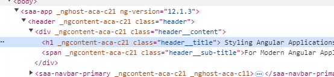
   So how does angular keeps CSS only at the component scope? Angular inserts the styles of all of our componets at the head and tags them with the same _ngContent_ attributes. That is how, for example, div elements can have global style, generic for div elements of the entire app, or they can have specific style within a component that does not get overriden by the main style one.
   See how the styles in the header get tagged with the ngContent:
   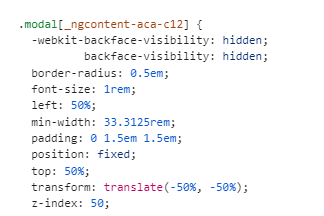
2. None: we stop seeing the _ngContent_ and _host_ attributes. So all styles go to the header but individual component styles get overriden by the default ones. Why use this? Some use cases require that. As an example, we can set the view encapsulation to none at the app component level. The app component is a good place to put styles that will be applied globably. The styles of the app component are also the first ones to appear in the header.
3. Shadow DOM: this will use the shadow dom native capability of the browsers that actually support it. There will be no emulation. An actual shadow root will be created which will isolate the markup and css outside of the scope of the parent document. See the shadow dom in chrome:
   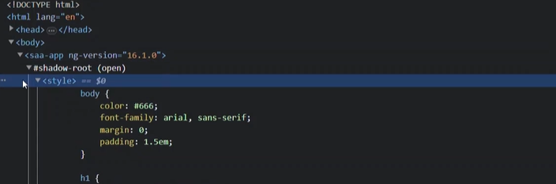
   This would break the app in older browsers.
   Changing the view encapsulation mode can only be done per component basis, inside the component decorator.
   It is probably just better to stick with the default emulated mode.

## Component Styles

There are several ways to add styles to the component: using styles property, inserting them directly on a template, using a separate style sheet with a traditional link tag or use the styleURL of the component, inline directly on the elements (not a good idea) etc.
Angular these days just uses separate style sheets for the component with styleURL at the component level by default.

## CSS Scoping

Angular emulates the behavior using a handfull css selectors from the css scoping module. These selectors allow us to target what we consider the host element of our components using _:host_ pseudo class. It also allows use to detect a particular context of an element using _:host_context_ pseudo class.
We can even go through the shadow elements to style child component using the ng-deep.

### Host pseudo class

In the view encapsulation mode, every component has what is considered a host element whose shadow tree contains all of the nodes from the component view. With the css scoping mmodule we can style this host using the host pseudo class. Modern browsers support that out of the box. But the view emulated mode of Angular gives us extra support for old browsers.
So what is the benefit? Sometime we might need to check if something like a class exists before applying styles to it, so we would add that class in our component declaration in html

```
<ourcomponent class="ourClass"></ourcomponent>

// in the css file
:host(.ourClass)
```

So we only target the host, when the host has a class on it.

### host-context pseudo class

To be used when we need to style our component based on the context it is applied, for example, dependent on the container our custom component is being used:
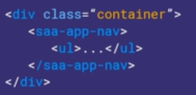
This css selector will scan the document tree where this component is inserted up to the root to see if any parent element matches the selection attribute. It will scan all parent elements including the host itself. So our styles will be applied if the host or any parent element match.
This can cause problems while reusing components where want different styles applied to them. Lets see the example of a component being reused inside of itself:

```
:host-context(.color-01){
  background: Red
  }

:host-context(.color-02){
  background: Yellow
  }

// template file
<ourcomponent class="color-01">
<ourcomponent class="color-02"></ourcomponent>
</ourcomponent>
```

With host-context the style applied would be the color 01 style. Because we are using host context both styles are applied but the last one wins. Changing to :host would fix the problem on this case.
So host-context should be used carefully.
It is also not so well supported by all browsers so it is recommended to use view emulative encaspulation of Angular.

### ng:deep

But what if we want to look down the tree? We can do this with the deep combinator to style nested components. We have the concept of content projection:

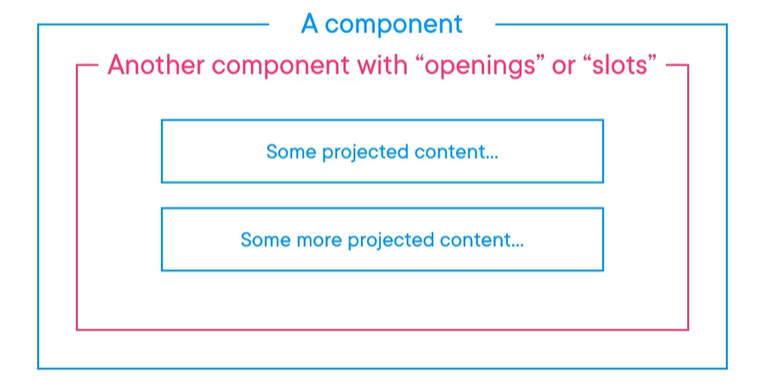

We can create _slots_ inside our components template, that we can use to display different content every time we use this component. It makes our component behave like other html elements. We basically inject content between the html tags of our element like:

```
<ourelement>
<customcontent></customcontent>
</ourelement>
```

We do that with the tag ng-content inside our custom element's template, the place where we want to display custom content. Then in the place we use our component we would just insert custom content like we see above.
The thing about this custom content is that the styles applied to the custom content will have the scope of the parent component, where ourelement is going to be used. Sometimes that is the dired behavior: think of dialogs. We want to display dynamic content and the style be determined on an individual case basis.
But sometimes, we may have a predictable structure and may not want to style on an individual basis.
This is where the deep combinator comes into play.
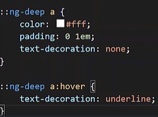
The problem is that Angular emulates the deep behavior by unscoping the anchor selectors so the styles will be applied to the entire document!!! Very careful.
It is a good idea to use host pseudo class before deep, so Angular will scope the styles (it is event recommended to scope to the parent element):
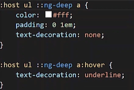

Deep was deprecated in Angular.

So now with this style info, let's see how to create maintainable style architecture styles in Angular.

## CSS and SCSS maintainable architecture

Before Angular, most of the styles would be declared in a global scope of an APP and then be used on an element basis. Angular changes the game an it is recommended that most of the styles reside outside of the global scope, keeping them specific to where they are used, because as the app grows, maintaining styles can become a nightmare.
There are though things that should still reside in the global space:

1. Browser resets
2. colors
3. Typography
4. Layout
5. Media queries
6. Utilities

If we want, Angular also allows us working the old way.

## Global Styles

There are several ways of managing global styles and we will covert two:

1. Class based system
2. Global Sass variable and mixin approach.

### Class based system

It is the one more similar to the traditional approach, with the difference that we have global, widely applied styles and then individual component styles.
First, we need somewhere to put the global styles.
Because we are using Sass, we can break our style sheets up into very small modular Sass partials that can be logically grouped and organized.
One way of implementing it is to use a directory like a _scsss_ in the app root and include there the styles, with Sass partials:
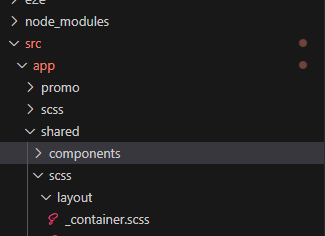

It can have a name more proper to the project. It just needs to be clear that we are talking about global styles.
It is importan to establish a naming convention for the styles across the app, to protect against style conflict and collusions. We do not want names of classes in the global styles conflicting with classes present in individual styles of the components.
For example layout styles could be prefixed with _l-_: l-content, for example.
So how do we include them in our components?
On way to do it is to add them in the root styles.scss:
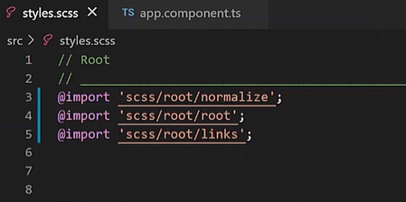

Another way to do is to turn view encapsulation off in the _app_ component and include them there using styles url property.
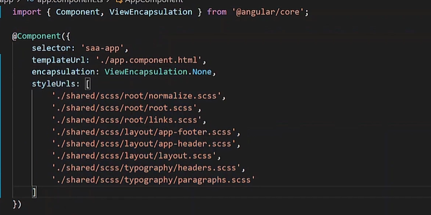
The main consideration here is if we need scoped styles for the app component itself. If yes, we cannot use this way. Plus, styles in our app component won't be available until our app is fully loaded. This can be a problem if we are relying on these styles for an app loading view, unlike in the first case.
Then we just need to add the global scoped classes to our elements.
Long ugly selectors everywhere like when we combine multiple classes within a same element: we can even have combinations of globaly scoped styles and individual component styles.

### Sass mixins and variables

Mixins allow us to define styles that can be reused throughout a style sheet:
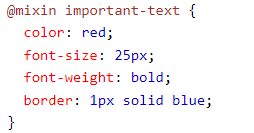
So we can convert this global items in variables and mixins and then import them and use them only when needed.
Lets see an example:
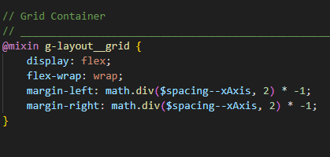
This is in a proper style file, SASS partial, but then we can just reuse, for example, in an individual component style sheet:
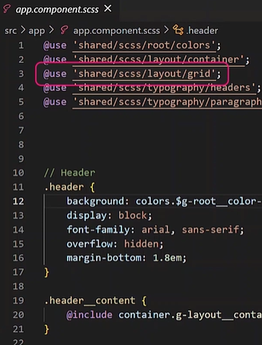

As a rule of thumb is better to not ovveride styles and start each individual component on a clean slate because things can get complicated as the app grows. Or almost clean. it can be a good idea to use a browser reset as a starting point for a component style
Browser reset are simply a collection of styles that are intended to normalize the inconsitencies across browsers before adding any custom app css.
This gives us the freedom to compose things as needed: we can include or not the mixins. It allows us to opt in and opt out, with minimal chage to the template.
We just remove the mixin from our selector and that is it.
Mixin completely seperates the structure from the representation, it is a more flexible approach to the global styles.
Once our SASS is processed into raw css, the code is going to be duplicated, which is ok.

When we use a pre processor like SCSS and global styles we need to use the relative paths everywhere we need them: maitnance nightmare, whenever we decide to change structure.
In the Angular.json config file, in the option obejct, we can add style preprocess options:

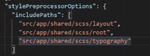
Then the imports only need the file name:
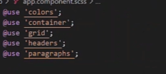

It is important to follow good nming conventions for styles even at component level: we never know how big the components are going to get.
One of the most used CSS naming methodology is BEM: block element modifier. It advocates for:

1. Standalone blocks
2. Meaningful on their own
3. Can be moved with little worry and styles from these blocks will not collide with other blocks.

The name convition is simple:
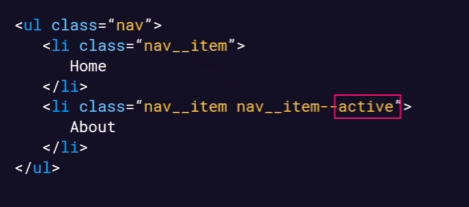

We have a block (nav), an element (nav**item) and a modifier (nav**item nav\_\_item--active).
A modifier can be thought of an part whose state can change. Following the methodology the css is way more focused and easier to work with overtime. In angular this is not a problem because the css is local to the component. Traditional web would require big names.

# Sizing with Relative Units

Nowadys instead of pixel numbers, units like ems rems, percentages, etc. This helps to desgin responsive systems. We need to consider in angular how the cascading of these units will afect our components: like imagine reusing a component somewhere else, how would the relative/fixed units affect the overall layout?
The answer is to write dynamic CSS.
So instead of using hard coded pixels, for example we can use ems in conjunction with th _.host_ pseudo class.
Components can be used inside other components, etc. So we need a system like the rem unit.
With every component, we can set its base font sixe to 1 rem so the component font sizes are predicable.
The em unit is relative to the font size of its parent element, which can lead to compounding effects if not managed carefully. In contrast, the rem unit is relative to the font size of the root element, providing a consistent sizing method that avoids compounding issues

### CSS selectors and style overrides

The default selector should be class and we should only veer from this when there is absolutely no other way.
Pretty much all elements get a class, following the BEM rule. In the style sheet we follow the same logical order.
We should avoid ID altogether in angular given the styles are scoped to the component.

We should avoid overriding styles: imagining styles for active or intactive.
We should avoid the approach of having a general style and then a style override for active and then one for inactive. It is considered good practice to have 2 separate styles and choose based on state.The same for responsive screens.

When a component gets too big, it is also possible to separate the scss file into multiple files and use them in the main component scss file: so the main file would only contain the partials and not styles at all.

Mixins and variables should be as local as possible. Variables can be scoped to a css block, to an entire component file. Mixins can be scoped with a component, globally or within sections. We can decide if a section compromising several components can reuse mixins.

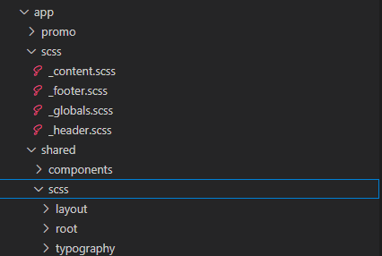

Analyze te directory and see mixinbs shared within a component or multiple components. It is very powerfull to maintain styles, In the app folder we have an scss folder, specifically for the app component. then we have a shared folder with components and scss. That scss is shared across multiple components and the mixins are being reused everywhere.

On good point that is usefull for the moment the app is loading is that we can include markup and style code in our index file, so we give nice usr experience while the app still loads.

## Component Theming

Layouts and colors may vary depending on the context a component is used. Layouts and colors define themes.
We need a system first.
As a starting point we can add a file for each individual layout a component can have. We can do the same for colors.
When we have such structure in place we can decide how to define which theme to use depending on the context the component is being used.

### Style with .host pseudo class

So we have two possible layouts for showing thumb nail list, for example. We separate these two layouts in two files and we use the host pseudo class. The parent component when using the thumbnail list will define the class to be used so the style will be applied accordingly.
Layout1 of the thumbnail component:

´´´
:host(.layout--01) {

    .item {
        align-items: flex-start;
        display: flex;
        justify-content: space-between;
        margin-top: 1em;
    }}

    :host(.layout--02) {

    .items {
        @include g-layout__grid;
    }}

´´´
We follow the same strategy for colors.
We use the thumbnail in the promo.component:

´´´
<saa-thumbnail-list
[ngClass]="isColor01 ? 'color--01' : 'color--02'"
class="layout--01 ">
</saa-thumbnail-list>
´´´
So here the thumbnail will have the layout1. If we decide to use the layout 2 we just change the class name.
The color is a litte more ticky. Because we want the color to depend on a class not from the promo component but from the parent of the promo component.
We set a property and we define in the typescript file if we show the color 1 or 2:
´´´
constructor(private hostRef: ElementRef) {}

    ngAfterContentInit(): void {
        this.isColor01 = this.hostRef.nativeElement.classList.contains('color--01');
    }

´´´
So the hostref is basically the parent of the promo component. So we are chaining the style based on the grand parent.

### Using the hostContext psuedo class

When we use host context we leverage the relatioship between the 2 components.
The first step is to create the CSS for the default theme. Then we add variations and the host context pseudo class. It can be combined with CSS selectors:
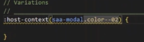
The styles defined here will only be applicable when out tab is inside the modal component and it has the color 02 class.

## Conditional content display

We always encounter scenarios where we need to decide if we render or not portions of the component view.
For example, let's consider our message component. We may or may not need to render the description and its icon based on the fact if the content has been provided or not:
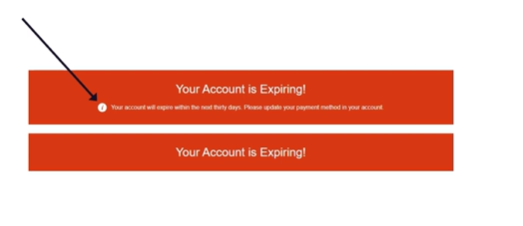
In our message content template we have ng content slot for a message:
<ng-content select="[slot-message]"></ng-content>
We want to add logic to verify if content has been provided using this directive and if so we want to render the message content div. So we need a content child decorator in our class. We need this because this message will be outside of our component template (it will be in the component that will use the message.component).
The child decorator looks like this in the component class file:

```
    @ContentChild('messageContent') messageContent: ElementRef;
```

Then in the template, we use the ngif directive:

```
 <div class="message__content" *ngIf="messageContent">
```

Another scenario we may run into is to render a portion of the component template based on the layout class provided to the component.
What if this component can assume two possible layouts?
So we add is layout01 property

```
export class MessageComponent implements AfterContentInit {
    @ContentChild('messageContent') messageContent: ElementRef;
    isLayout01 = false;

    constructor(private hostRef: ElementRef) {}

    ngAfterContentInit(): void {
        this.isLayout01 = this.hostRef.nativeElement.classList.contains('layout--01');
    }
}
```

And then on the template :

```
        <svg class="message__icon" viewBox="0 0 24 24" *ngIf="isLayout01">
            <path d="M12 0c-6.627 0-12 5.373-12 12s5.373 12 12 12 12-5.373 12-12-5.373-12-12-12zm-2.033 16.01c.564-1.789 1.632-3.932 1.821-4.474.273-.787-.211-1.136-1.74.209l-.34-.64c1.744-1.897 5.335-2.326 4.113.613-.763 1.835-1.309 3.074-1.621 4.03-.455 1.393.694.828 1.819-.211.153.25.203.331.356.619-2.498 2.378-5.271 2.588-4.408-.146zm4.742-8.169c-.532.453-1.32.443-1.761-.022-.441-.465-.367-1.208.164-1.661.532-.453 1.32-.442 1.761.022.439.466.367 1.209-.164 1.661z"></path>
        </svg>
```

So we do render the icon only if the layout is the layout 01.

## Css custom properties

This is all about opening components for extension by using hooks with CSS custom properties. These hooks are available to parent components.
The first step to create a variable, using the var keyword with parentheses. Inside them we define the variable name that should be prefixed by 2 dashes (see background and color). Example of our message component:

```
:host {
    background: var(--background, #ff0000); // variable name with default value red
    color: var(--foreground, white);
    font-size: 1rem;
    margin: 1.5em 0;
    padding: 1em 1.5em;
}

```

Then these variables can be set in the parent style sheet. Example of our modal component, showing message and overriding the variables:

```
:host(.color--02) {

    // CSS Custom Properties
    --background: #C43B0E;
    --foreground: white;

    .modal {}}
```

This is the power of custom css properties. The modal is the parent of the message component. But the modal component itself is dependent on a host for its styles. This is the cascading of the css properties.
