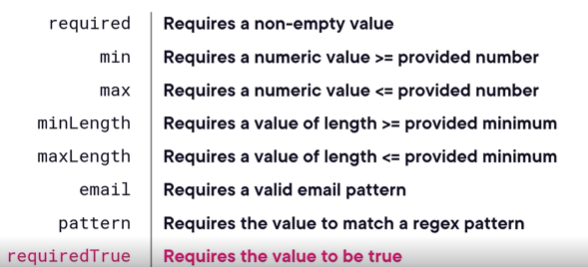

# Template driven forms

Using template driven forms is a great approach to gather user inputs. Let's see an example:


On a form like this one there is a lot to keep track. For each field we might want to track:

1. User input
2. Validity (if the field is not valid, we want to show an adorner error messsage).
3. If the field is dirty (has a changed value)
4. If it is touched: we do not want to display errors, for example. the first time a screen loads and all fields are empty.

It is a lot to keep track when we have lots of fields.. And we are not even taking into account the form as a whole and the combination of all of its fields: the validity of the form as whole, if it is dirty, etc..

This is where Angular forms come in. Angular tracks all this data for us with 2 main objects, whenever we add certain directives on our forms or input elements:

1. FormControl: A form control is created automatically when we add the ngModel Directive into a field. A form control tracks if a single control is invalid, dirty, touched plus all the corresponding inverse properties.

2. FromGroup: A form group is made up of several form controls and it tracks all of these same properties. It can be used to wrap an entire form for form-level validation or a section of a form.

Both template driven forms and reactive forms use this type of architecture, but in reactive forms it is on us to create this type of objects and infrastructure.

The architecture summarized: form controls can be grouped in form groups and form groups can be grouped into what is called the form model:


## Template driven vs reactive forms

Both forms use the same type of underlying architecture:


In template driven forms, these objects are created for us. In reactive forms, we are the ones creating them and working with them in our component's classes.

So what is the difference in practice?


1. Template driven forms are mostly managed inside the HTML template where as reactive forms are largely defined inside components typescript class. We can create local template variable using # and access its attribute for validation right inside the template.
2. Template driven forms use a separate data model we define where as in reactive forms the data model is managed internally by form controls
3. Template driven forms use two way bindings (mutable) and reactive form use one way binding from the component to the template. User input changes are handled with events.
4. Given the event nature, template driven froms use synch data flow and reactive forms async data flow.
5. In template, validation is handled with directives where as in reactive with functions.

Reactive forms may be better form complex forms with lots of backend logic, whereas template driven forms are more lightweight and quicker to implement.

Before diving in, we are using an Angular in memory web api. So we simulate actually http calls to the server but in memory.
When we click in a contact we navigate to the edit form. Check the Url we pass the id as the argument.

## Add template driven forms into a projec

1. Import the forms module. Because we are not using modules we do it inside our component directly (edit contact):

```
import {FormsModule} from '@angular/forms'

@Component({
  imports: [CommonModule, FormsModule],
  standalone: true,
  templateUrl: './edit-contact.component.html',
  styleUrls: ['./edit-contact.component.css']
})
```

2. Define the base HTML template of our form.
3. Define the data model. We need the data model to collect user input and use data binding. In our case we have the complex type contact.model and we define that as a property in the component class file:

```
  contact: Contact = {
    id: '',
    firstName: '',
    lastName: '',
    dateOfBirth: null,
    favoritesRanking: 0,
    phone: {
      phoneNumber: '',
      phoneType: '',
    },
    address: {
      streetAddress: '',
      city: '',
      state: '',
      postalCode: '',
      addressType: ''
    },
  }
```

4. Wire the the template to the newly created property using the ngModel directive. We use the ngModel directive on the fields we want to keep in sync with our model. Because we need a 2 way binding we do it like this:

```
        <input placeholder="First Name" [(ngModel)] = "contact.firstName" name="firstName" />
```

The ng model uses a name attribute behind the scenes, so that is why we have the name. For nested properties:

```
[(ngModel)] = "contact.phone.phoneNumber" name="phoneNumber"
```

When we use ngModel, behind the scenes, we have a control value accessor. So there is more than just a 2-way data binding. Angular attaches a directive to the element called control value accessor. There are plenty of control value accessors like the CheckboxValueAccessor, DefaultValueAccessor.
The default one, for example, tranforms a null into an empty string before displaying it in the browser. The checkbox one converts the the checked state into a bool.
We can create our own too.

## Submitting the form

According to HTML standards, we should use a submit button with a submit action on our actual from element. This allows the user to click enter.
This behavior is accomplished by using the angular directive ngSubmit at the form level:

```
  <form (ngSubmit)="saveContact()">
```

And the button submit:

```
<button class="primary" type="submit" >Save</button>
```

## Working with ngForm

There is an alternative way to work with the values gathered from the HTML. Given that we imported the forms module, there is a directive behind the scenes that gets assigned to the template ngForm.
We can get it using a template variable like this

```
  <form (ngSubmit)="saveContact()" #contactForm="ngForm">
```

It gives access to the form group of our form.
The ngForm will have properties for each of the forms elements. We can for example pass the #contactForm variable in our save contact:

```
  <form (ngSubmit)="saveContact(contactForm)" #contactForm="ngForm">
```

Then in our component class:

```
  saveContact(form: NgForm) {
    console.log(form.value)
   this.contactService.saveContact(this.contact).subscribe({
    next: () => this.router.navigate(['/contacts'])
   })
  }
```

The output of that log of the form.value is:


See that on the ngForm the phone number and phone type are not nested in an object like in our model. All properties are at the root. We can fix that by adding a ngModelGroup: it surrounds multiple input elements.

```
 <div class="flex-column" ngModelGroup="phone">
 This phone matches our phone property in our model.
```

If we do the same for the address, our ngForm will match our data model and we can pass the form.value to our service like this:

```
  saveContact(form: NgForm) {
    console.log(form.value)
    this.contactService.saveContact(form.value).subscribe({
  //  this.contactService.saveContact(this.contact).subscribe({
    next: () => this.router.navigate(['/contacts'])
   })
  }
```

The thing that needs to be taken into account here is that form.value will only contain the values from the input fields but, when we fetch the data from the API, while loading the page, the objects come with an ID that is not present in the ngForm.
In order to preserve that we can bind the id into a hidden (the users should not be messing with ids) input element:
<input type="hidden" [ngModel]="contact.id" name="id"/>

## Form submitted

It is important to know when a form has been submitted or not. In some cases, we want to prevent the same form being submitted twice. We can work with ngSubmitted class or with ngForm.Submitted property.
Lets hide the buttons save and cancel and display a Saving button when the user submits the form, thus preventing the user to submit twice.
Using ngForm:

 <div class="buttons">
      <button *ngIf="!contactForm.submitted" class="secondary" type="button">Cancel</button>
      <button *ngIf="!contactForm.submitted" class="primary" type="submit" >Save</button>
      <button *ngIf="contactForm.submitted" disabled>Saving...</button>
    </div>
We here use our template variable to inside the template hide the save button if the form has not been submitted.
When the user submits the form angular adds the ngSubmitted class to our form and we can target it with css:

button.saving{
display: none;
}

form.ng-submitted button{
display: none;
}

form.ng-submitted button.saving{
display: block;
}

We add class saving to our saving button. So when the form gets the ng.submitted class, we tartget the saving button to become visible and hide all the other buttons.

## Working with common user controls

### Radio buttons

Just like you would do in plain html we declare each individual radio button on the template but we give the same name to all of them, so they work as a group. :

        <div class="radio">
          <input type="radio" value="mobile" [(ngModel)] = "contact.phone.phoneType" name="phoneType"> Mobile
          <input type="radio" value="work" [(ngModel)] = "contact.phone.phoneType" name="phoneType"> Work
          <input type="radio" value="other" [(ngModel)] = "contact.phone.phoneType" name="phoneType"> Other
        </div>

There is an alternative way of doing it. We can define an array with ngFor (we have to declare the phoneValueTypes):

```
<span *ngFor="let phonetype of phoneValueTypes">
<input type="radio" [value]="phonetype.value" [(ngModel)] = "contact.phone.phoneType" name="phoneType"> {{phonetype.title}}
</span>
```

A select list works similar to radio buttons. Actually a little simpler and the same can be done there.

### Checkboxes

Check boxes in angular have some uniqueness to them. In plain HTML we could set the value attribute of a checkbox
to a string. Angular just ignores that value, even if we delcare it on the model feedbing the checkbox, This happens because of the source directive angular creates when we apply ngModel to the checkbox.
We have a checkbox value accessor, that sits between the html and the model and it only checks for the checked state of the checkbox.

### Numeric inputs

When we declare a type as numeric in typescript, the numeric type is just a development aid. If we log the type in the console of our favouritesRanking, we see string.
The element has the default control value accessor, and this fdefault value accessor always updates the form model with a string value.
Angular documentation says that there is a numeric value accessor. To use that we just change the input attribut to numberÇ
<input placeholder="Favorites Ranking" type="number" [(ngModel)] = "contact.favoritesRanking" name="favoritesRanking" />
It is a good practice to use numeric value accessor for numeric types. The console would now print number instead of string.
If we use range, angular uses range value accessor. It is still numeric.

### Date fields

If we just use the default input text, it means we just use the default value accessor behind the scenes which treats all values as strings regardless of data types. Angular does not have an out-of-the-box date value accessor. So how do we work with dates?

We can create our own cystom control value accessor or just handle dates as strings which is not a bad path to go (dates are a mess in javascript and not een support in json).
We jus use din this module : .toISOString().split('T')[0],

## Validating user inputs

Validation in template driver froms is done by adding validator directives to the HTML elements. Some built-in validators:

We can also create custom validators if none of these suit our needs.

### Add validation

Lets add the required attribute to the first name. We do that just by adding 'required'.
But this would display an error message even when the user first loads the page, which is not nice user experience.
The ngModel creates a form control that tracks the state of a single element:
IsTouched, IsDirty, etc..
So we create a template variable to access the form control:
<input placeholder="First Name" [(ngModel)] = "contact.firstName" required #firstName="ngModel" name="firstName" [class.error]="firstName.invalid && firstName.touched" />
<em \*ngIf="firstName.invalid && firstName.touched">Please enter the first name.</em>
Multiple validators start to add complexity. Errors messages should be targeted to the validation operation that is actually failing.
We can leverage the errors object. If the required validation fails, the erros object will have a required property, for example.
<input placeholder="First Name" [(ngModel)] = "contact.firstName" required minlength="3" #firstName="ngModel" name="firstName" [class.error]="firstName.invalid && firstName.touched" />
<em *ngIf="firstName.errors?.['required'] && firstName.touched">Please enter the first name.</em>
<em *ngIf="firstName.errors?.['minlength'] && firstName.touched">First name needs at least 3 characters.</em>

        We use null operator because the property might not even exist if there are no errors. To access nullable properties typsecript requires the braket syntax.

### Validating form groups and forms

Previously we added nggroups directives to phone and address and we also passed the ngForm as an argument to the save method.
Behind the scenes, angular creates form groups for our address and phone fields.
To access that we can create another template variable:

<div class="address" ngModelGroup="address" #addressGroup = "ngModelGroup">

If any of the fields of these forms groups is invalid, the whole group is invalid.
So we can levarage this and have a generic validation for a group of fields, for example:

      <em *ngIf="addressGroup.invalid && addressGroup.dirty">Incomplete address.</em>

If we add a required attribut to all the address fields, we can use the whole group to access if the state is valid, instead of checking all individal fields.
Our entire form is also a form group. We can levaregae this to prevent submit if the entire form is not valid:
<button class="primary" type="submit" [disabled] ="contactForm.invalid" >Save</button>

## Custom validator

They are quite easy to implement. They need to implement a validator interface. See this:
import {Directive} from "@angular/core";
import {AbstractControl, NG_VALIDATORS, Validator, ValidationErrors} from "@angular/forms"

```
import { Directive } from '@angular/core'
import {
    NG_VALIDATORS,
    AbstractControl,
    ValidationErrors,
    Validator,
} from '@angular/forms'

@Directive({
    selector: '[restrictedWords]',
    standalone: true,
    providers: [
        {
            provide: NG_VALIDATORS,
            multi: true,
            useExisting: RestrictedWordsValidator,
        },
    ],
})
export class RestrictedWordsValidator implements Validator {
    validate(control: AbstractControl): null | ValidationErrors {
        if (!control.value) return null

        return control.value.includes('foo') ? { restrictedWords: true } : null
    }
}

```

Inside the validate method is where we put the validation logic.
The Angular Forms module needs to know what are the multiple custom validation directives available. It does so by asking the dependency injection system for the NG_VALIDATORS injection token (a sort of unique dependency injection key, that uniquely identifies a dependency).

This dependency in of type multi:true meaning that it includes multiple values, and not just one value. This is to be expected, as there are many custom validator directives, and not just one.

In a project using modules we would make this validator available for use by importing them into a module. Because we use standalone components, we just import where needed (components class.)

So how to use our custom validator? We need to import now the directive in the component classe files, for the components that will need this validator. Then we just include the selector in the template of the same components:

```
import { RestrictedWordsValidator } from '../validators/restricted-words-validator.directive'
```

And then , in the template file:

      <textarea placeholder="notes" rows ="3" [(ngModel)] = "contact.notes" name="notes" #notes="ngModel" restrictedWords [class.error] = "notes.invalid" ></textarea>
    <em *ngIf="notes.errors?.['restrictedWords']">Restricted words.</em>

We know our custom validator will fail because we can check the errors object. The errors object will have a property with the name of our validator selector.
We cant pass additional parameters to the validate function because we implement the validator interface. But we can pass and retrieve data from the validator.
We do that like we do for all the other directives: input decorator.

```
@Input('restrictedWords') restrictedWords : string [] = []
```

Then in our template we can define what are the restriced words:
<textarea placeholder="notes" rows ="3" [(ngModel)] = "contact.notes" name="notes" #notes="ngModel" [restrictedWords] = "['foo', 'bar']" [class.error] = "notes.invalid" ></textarea>

So we change the validator to return the list of invalid words like this:

```
export class RestrictedWordsValidator implements Validator {
    @Input() restrictedWords: string[] = []
    validate(control: AbstractControl): null | ValidationErrors {
        if (!control.value) return null

        // list of invalidate words.
        const invalidwords = this.restrictedWords.map((w) =>
            control.value.includes(w) ? w : null
        ).filter(w => w !== null);

        // here we actually set as the return of this validatior the list of invalid words joined by a comma
        return invalidwords.length > 0 ? { restrictedWords: invalidwords.join(',') } : null
    }
}
```

And then we show the invalid words in an error message (easy peasy):
<em \*ngIf="notes.errors?.['restrictedWords']">Restricted words {{notes.errors?.['restrictedWords']}}</em>

## Custom controls and controlValueAccessors

Like we have seen Angular does not have a control value accessor to work with dates, so we work with dates by using strings. We can also create our default control value accessor though.
An accessor is a directive and we can configure the directive selector to be used with all input fields of type date.
To remember that a ControlValueAccessor handles updating an HTML element value when its bound data model field changes. It is also responsible to update the data model when the HTML element's value changes.
So basically we need to implement the ControlValueAccessor interface. The functions to implement are the following:

```
@Directive({
  selector: 'input([type=date])[ngModel],input([type=date])[formControl],input([type=date])[formControlName]',
  standalone: true
})
export class DateValueAccessorDirective implements ControlValueAccessor {

  constructor(private element: ElementRef) {

   }

  // called whenever the bound data model field value changes, updating the html element
  writeValue(newValue: any): void {
    if(newValue instanceof Date){

    this.element.nativeElement.value = newValue.toISOString().split('T')[0]
    }
    //yyyy-mm-dd
  }

  // to handle the changes in the html elements we need to register to the events. We fetch the event target property as date
  // That will return the text of the input element as a date. sowhen the input event fires it will call our onChange method and pass in the valueAsDate value.
  @HostListener('input', ['$event.target.valueAsDate']) private onChange!: Function

  // when angular sees a control value access directive it call the register on change and provides the callbackfuntion we need to call to update our data model
  // so our function fetches the value as date from our input element and we pass the value as an actual date object to the callback angular provides us.
  registerOnChange(fn: Function): void {
   this.onChange = (valueAsDate: Date) => {fn(valueAsDate)};
  }

  @HostListener('blur', []) private onTouched!: Function
  registerOnTouched(fn: Function): void {
    this.onTouched = fn;
  }
  setDisabledState?(isDisabled: boolean): void {
    throw new Error('Method not implemented.');
  }
}
```

In the component classe file the new control value accessor needs to be imported.

## Custom input controls

We created a new component first, called profile-icon-selector that shows all icons if the user did not select an icon.
The thing is that this icon is still not working with our data model by default.
To wire up a costum component with data model we need to implement the control value accessor interface.
After that, we can use the ngModel directive directly on our custom component.

## Dynamic forms

Dynamic forms are handy for scenarios like adding user contacts for example. We should be able to add within the same form as many contacts as we would like.
first step is to verify if our data models support such structure.
There are challenges with dynamic forms and using the ngForm the way we were using it until now with the ngSubmit. In the phone example, once we click submit the object will never be valid. TThe object is going to have repatable properties for every contact added into the collection.
We need to work directly with the data models instead of working with ngForm like done until now.

This is a limitation of the ngForm. It mirrors the HTML structure. When we submit the form the object looks like this:


We do not have an array. We have a phones object with repeatable properties instead. So the object of ngForm and our model are not actually the same. Given the fact we have ngModel and 2 way data binding everywhere we can just pass the model instead:

```
    saveContact(form: NgForm) {
        console.log(form.value)
        this.contactService.saveContact(this.contact).subscribe({
        // this.contactService.saveContact(form.value).subscribe({
            //  this.contactService.saveContact(this.contact).subscribe({
            next: () => this.router.navigate(['/contacts']),
        })
    }

```

So instead of submitting the ngForm value into our save contact.
As a last exercise of this module, let's add functionality to the puls button to just add a new phone field. Given the fact we use ngForm to render the html dinamically, we just need to add an empty object to the array of phones.
