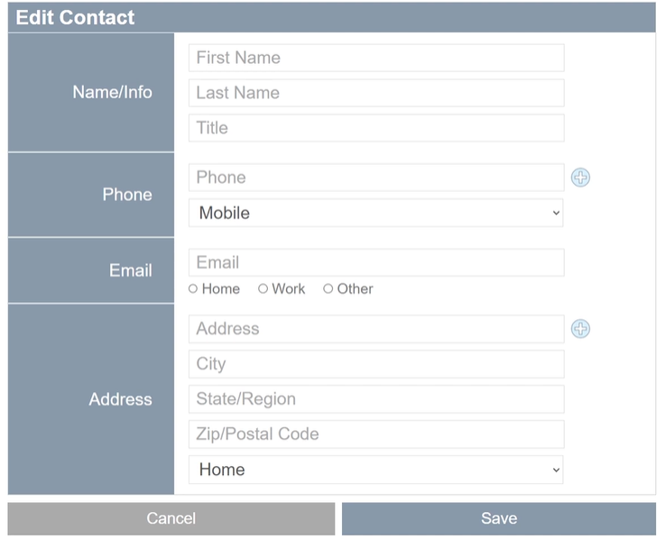
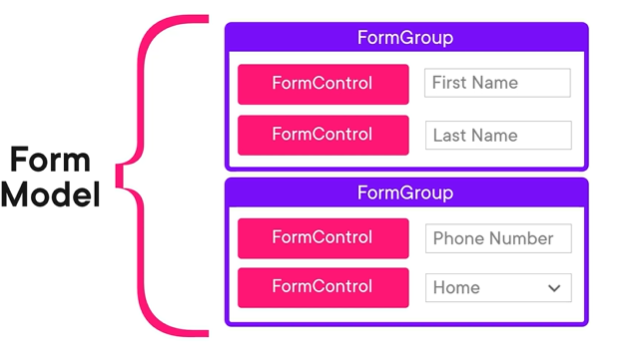
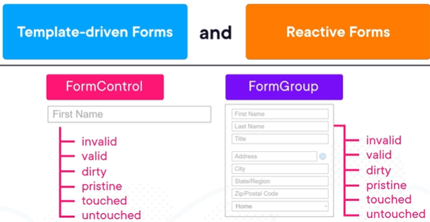
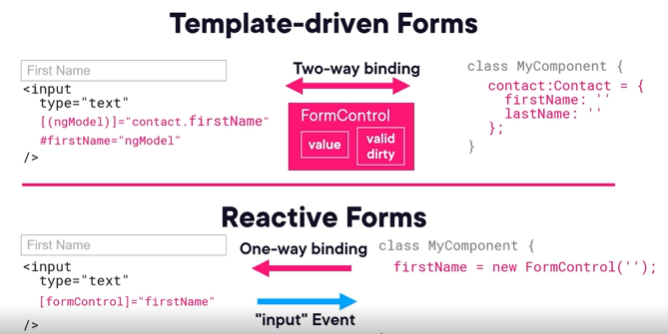
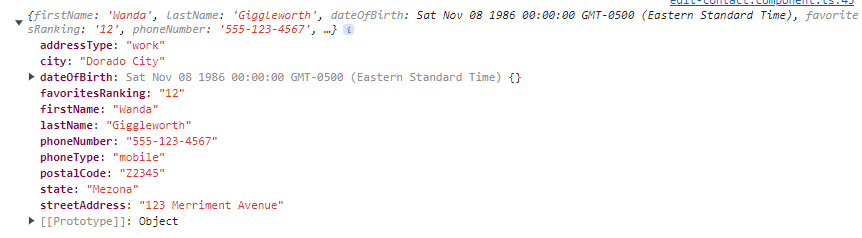

# Template driven forms

Using template driven forms is a great approach to gather user inputs. Let's see an example:


On a form like this one there is a lot to keep track. For each field we might want to track:

1. User input
2. Validity (if the field is not valid we want to show an adorner error messsage)
3. If the field is dirty (has a changed value)
4. If it is touched (we do not want to display errors for example the first time a screen loads and all fiedls are empty).

It is a lot to keep track, when we have lots of fields.. And we are not even taking into account the form as a whole: the validity of the form as whole, if it is dirty, etc..

This is where Angular forms come in. Angular tracks all this data for us with 2 main objects, whenever we add certain directives on our forms or input elements:

1. FormControl: A form control is created automatically when we add the ngModel Directive into a field. A form control tracks if a single control is invalid, dirty, touched plus all the inverse properties.

2. FromGroup: A form group is made up of several form controls and it tracks all of these same properties. It can be used to wrap an entire form for form-level validation or a section of a form

Both template driven forms and reactive forms use this type of architecture but in reactive forms it is on us to create this type of objects and infrastructure.

The architecture summarize: form controls can be grouped in form groups and form groups can be grouped into what is called form model:


## Template driven vs reactive forms

Both forms use the same type of underlying architecture:

In template driven forms these objects are created for us. In reactive form, we are the one creating them and working with them in our component's classes.
So what is the difference in practice?



1. Template driven forms are mostly managed inside the HTML template where as reactive forms are largely defined inside components typescript class. We can create local template variable using # and access its attribute for validation right inside the template.
2. Template driven forms use a separate data model we define where as in reactive forms the data model is managed internally by form controls
3. Template driven forms use two way bindings (mutable) and reactive form use one way binding from the component to the template. User input changes are handled with events.
4. Given the event nature, template driven froms use synch data flow and reactive forms async data flow.
5. In template, validation is handled with directives where as in reactive with functions.

Reactive forms may be better form complex forms with lots of backend logic whereas template driven forms are more
lightweight and quicker to implement.

Before diving in, we are using an Angular in memory web api. So we simulate actually http calls to the server but in memory.
When we click in a contact we navigate to the edit form. check the Url we pass the id as the argument.

## Add template driven forms into a projec

1. Import the forms module. Because we are not using modules we do it inside our component directly (edit contact):

```
import {FormsModule} from '@angular/forms'

@Component({
  imports: [CommonModule, FormsModule],
  standalone: true,
  templateUrl: './edit-contact.component.html',
  styleUrls: ['./edit-contact.component.css']
})
```

2. Define the base HTML template of our form.
3. Define the data model. We need the data model to collect user input and use data binding. In our case we have the complex type contact.model and we define that as a property in the component class file:

```
  contact: Contact = {
    id: '',
    firstName: '',
    lastName: '',
    dateOfBirth: null,
    favoritesRanking: 0,
    phone: {
      phoneNumber: '',
      phoneType: '',
    },
    address: {
      streetAddress: '',
      city: '',
      state: '',
      postalCode: '',
      addressType: ''
    },
  }
```

4. Wire the the template to the newly created property using the ngModel directive. We use the ngModel directive on the fields we want to keep in sync with our model. Because we need a 2 way binding we do it like this:

```
        <input placeholder="First Name" [(ngModel)] = "contact.firstName" name="firstName" />
```

The ng model uses a name attribute behind the scenes, so that is why we have the name. For nested properties:

```
[(ngModel)] = "contact.phone.phoneNumber" name="phoneNumber"
```

When we use ngModel behind the scenes we have a control value accessor. Behind the scenes there is more than just a 2way data binding. Angular attaches a directive to the element called control value accessor. There are plenty of control value accessors like the CheckboxValueAccessor, DefaultValueAccessor.
The default one, for example, tranforms a null into an empty string before displaying it in the browser. The checkbox one converts the the checked state into a bool.
We can create our own too.

## Submit the form

According to HTML standards we should use a submit button with a submit action on our actual from element. This allows the user to click enter.
This behavior is accomplished by using the angular directive ngSubmit at the form level:

  <form (ngSubmit)="saveContact()">

And the button submit:
<button class="primary" type="submit" >Save</button>

## Working with ng form

There is an alternative way to work with the values gathered from the HTML. Because we imported the forms module there is a directive behind the scenes that gets assigned to the templateÇ ngForm. We can get it using a template variable like this

  <form (ngSubmit)="saveContact()" #contactForm="ngForm">

It gives access to the form group of our form.
The ngForm will have properties for each of the forms elements. We can for example pass the #contactForm variable in our save contact:

  <form (ngSubmit)="saveContact(contactForm)" #contactForm="ngForm">

```
  saveContact(form: NgForm) {
    console.log(form.value)
   this.contactService.saveContact(this.contact).subscribe({
    next: () => this.router.navigate(['/contacts'])
   })
  }
```

The output of that log of the form.value is:


See that on the ngForm the phone and phone type are not nested in an object like in our model. All properties are at the root. We can fix that by adding a ngModelGroup: it surrounds multiple input elements.

 <div class="flex-column" ngModelGroup="phone">
 This phone matches our phone property in our model.

If we do the same for the address, our ngForm will match our data model and we can pass the form.value to our service like this:

```
  saveContact(form: NgForm) {
    console.log(form.value)
    this.contactService.saveContact(form.value).subscribe({
  //  this.contactService.saveContact(this.contact).subscribe({
    next: () => this.router.navigate(['/contacts'])
   })
  }
```

The thing that needs to be taken into account here is that form.value will only contain the values from the input fields but, when we fetch the data from the API, while loading the page, the objects come with an ID that is not present in the ngForm.
In order to preserve that we can bind the id into a hidden (the users should not be messing with ids) input element:
<input type="hidden" [ngModel]="contact.id" name="id"/>

## Form submitted

It is important to know when a form has been submitted or not. In some cases, we want to prevent the same form being submitted twice. We can work with ngSubmitted class or with ngForm.Submitted property.
Lets hide the buttons save and cancel and display a Saving button when the user submits the form, thus preventing the user to submit twice.
Using ngForm:

 <div class="buttons">
      <button *ngIf="!contactForm.submitted" class="secondary" type="button">Cancel</button>
      <button *ngIf="!contactForm.submitted" class="primary" type="submit" >Save</button>
      <button *ngIf="contactForm.submitted" disabled>Saving...</button>
    </div>
We here use our template variable to inside the template hide the save button if the form has not been submitted.
When the user submits the form angular adds the ngSubmitted class to our form and we can target it with css:

button.saving{
display: none;
}

form.ng-submitted button{
display: none;
}

form.ng-submitted button.saving{
display: block;
}

We add class saving to our saving button. So when the form gets the ng.submitted class, we tartget the saving button to become visible and hide all the other buttons.

## Working with common user controls

### Radio buttons

Just like you would do in plain html we declare each individual radio button on the template but we give the same name to all of them, so they work as a group. :

        <div class="radio">
          <input type="radio" value="mobile" [(ngModel)] = "contact.phone.phoneType" name="phoneType"> Mobile
          <input type="radio" value="work" [(ngModel)] = "contact.phone.phoneType" name="phoneType"> Work
          <input type="radio" value="other" [(ngModel)] = "contact.phone.phoneType" name="phoneType"> Other
        </div>

There is an alternative way of doing it. We can define an array with ngFor (we have to declare the phoneValueTypes):

```
<span *ngFor="let phonetype of phoneValueTypes">
<input type="radio" [value]="phonetype.value" [(ngModel)] = "contact.phone.phoneType" name="phoneType"> {{phonetype.title}}
</span>
```

A select list works similar to radio buttons. Actually a little simpler and the same can be done there.

### Checkboxes

Check boxes in angular have some uniqueness to them. In plain HTML we could set the value attribute of a checkbox
to a string. Angular just ignores that value, even if we delcare it on the model feedbing the checkbox, This happens because of the source directive angular creates when we apply ngModel to the checkbox.
We have a checkbox value accessor, that sits between the html and the model and it only checks for the checked state of the checkbox.

### Numeric inputs

When we declare a type as numeric in typescript, the numeric type is just a development aid. If we log the type in the console of our favouritesRanking, we see string.
The element has the default control value accessor, and this fdefault value accessor always updates the form model with a string value.
Angular documentation says that there is a numeric value accessor. To use that we just change the input attribut to numberÇ
<input placeholder="Favorites Ranking" type="number" [(ngModel)] = "contact.favoritesRanking" name="favoritesRanking" />
It is a good practice to use numeric value accessor for numeric types. The console would now print number instead of string.
If we use range, angular uses range value accessor. It is still numeric.

### Date fields
